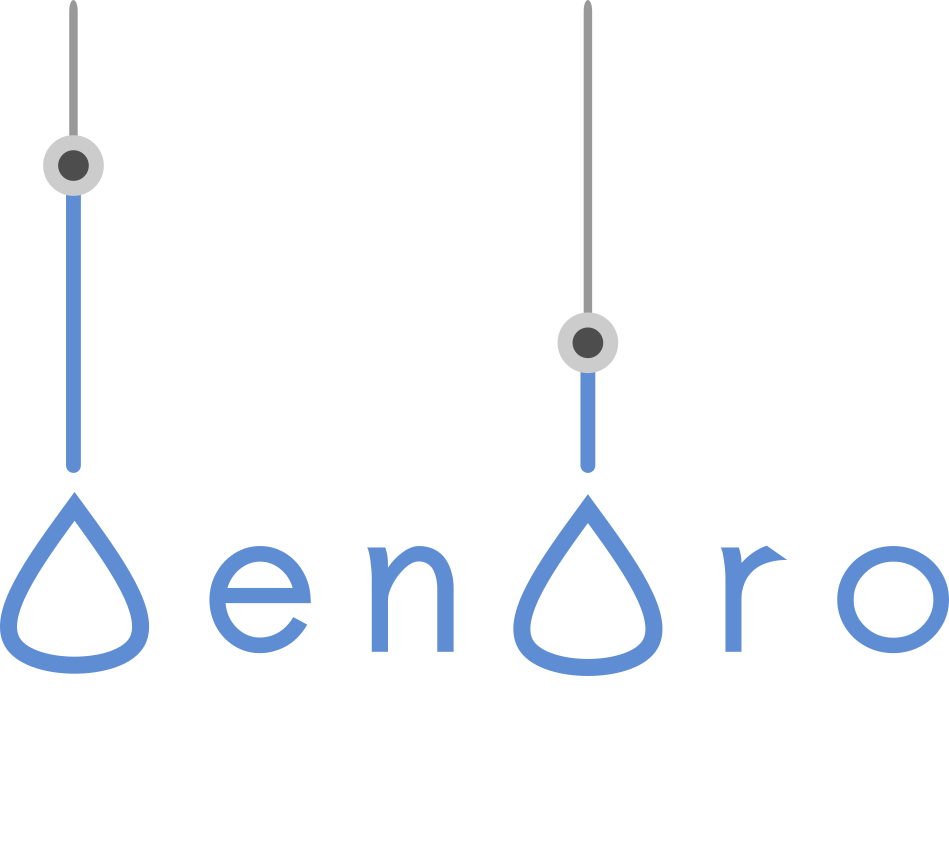

# DendroTweaks


<p>

DendroTweaks is a web-based Python toolbox designed to facilitate the creation and validation of single-cell biophysical models with active dendrites. 

For a quick overview of the toolbox, including a video demonstration, you can visit our [e-poster](https://doi.org/10.57736/abba-7149) presented at the FENS Forum 2024 in Vienna.

The toolbox can be accessed through an [online platform](https://r-makarov.github.io/DendroTweaksWeb/). Also there you can find a detailed [user guide](https://r-makarov.github.io/DendroTweaksWeb/guide.html).

Alternatively, the toolbox can be installed locally and run with a Bokeh server. 

The core functionality of the toolbox is also available as a standalone Python library, and interactive Jupyter notebooks are included in this repository.


## Table of Contents

- [Repository Structure](#repository-structure)
- [Installation](#installation)
- [Getting started](#getting-started)
- [Troubleshooting](#troubleshooting)


## Repository Structure
The repository is organized as follows:

```plaintext
dendrotweaks/
│
├── app/
│   ├── main.py                   # Main script to launch the Bokeh app
│   ├── view.py                   # User interface components for the app
│   ├── model/                    # Model logic
│   │   ├── mechanisms/           # Ion channel and synapse mechanisms
|   |   |   ├── collection/       # Python classes of ion channels
|   |   |   ├── mod/              # MOD files for NEURON
|   |   |   ├── mod_standard/     # Standardized MOD files
|   |   |   ├── pparser.py        # PyParsing parser for MOD files
|   |   |   ├── channels.py       # Base classes for ion channels
|   |   |   ├── groups.py         # Channel and synapse groups
|   |   |   ├── distributions.py  # Distribution class
|   |   |   ├── synapses.py       # Synapse classes
|   |   |   ├── template.mod      # JINJA template for standardized MOD files
│   │   ├── swc/                  # SWC files for neuronal morphologies
│   │   ├── cells.py              # NEURON cell class
│   │   ├── model.py              # Core model logic
│   │   └── swcmanager.py         # Manager class for SWC files
│   ├── presenter/                # Coordination of app components
│   │   ├── presenter.py          # Main presenter class
│   │   └── ...                   # Mixins for the presenter class
│   ├── static/                   # Static files (e.g., CSS, JS, user data)
│   └── templates/                # HTML templates for the app
│
├── notebooks/                    # Jupyter notebooks with demos
│   ├── standalone_demo.ipynb
│   ├── parsing_demo.ipynb   
│   └── swc_demo.ipynb          
│
├── environment.yml               # Conda environment configuration
├── requirements.txt              # Python dependencies for pip
├── README.md                     # Documentation and setup instructions
└── LICENSE                       # Project license
```

## Installation

In this section, we will explain how to locally install DendroTweaks and run it in GUI mode via a Bokeh server.

### Set Up a Conda Environment (recommended)
Create and activate a conda environment using the provided environment.yml file:

```bash
conda env create -f environment.yml
conda activate dendrotweaks
```

### Install Dependencies Using PIP (optional)

Alternatively, install required packages using pip:

```bash
pip install -r requirements.txt
```

### Run the Bokeh Server
To run the Bokeh server and launch the app locally, use the following command:

```bash
bokeh serve --show app
```

This will start the Bokeh server and automatically open your default web browser to display the app.

## Getting started

To create a new model, you typically need a neuronal morphology in the form of an `.swc` file and membrane mechanisms (`.mod` files) to be used in NEURON. In our demo, we provide some preset models for you to use:

- A pyramidal CA1 neuron from Poirazi et al. 2003
- A pyramidal L5 neuron from Hay et al. 2011
- A pyramidal L2/3 neuron from Park et al. 2019

To begin working with DendroTweaks, select a model morphology from the list of available `.swc` files in the left menu under the `Input / Output` tab. The morphology plot and the graph view will appear in the main workspace.

### Explore Neuronal Morphology

1. Navigate through different sections of the model using the `Cell` plot. Click on a section to select it.
2. Similarly, select segments from the `Graph` plot. You can use the lasso mouse tool to select multiple segments (hold the left mouse key and drag).
3. Note that all elements of the workspace are synchronized. For example, selecting a section in the `Cell` plot will result in selecting the corresponding segments on the `Graph` plot.


### Run a Simple Simulation

1. Go to the `Input / Output` tab in the left menu. Import predefined biophysical parameters by clicking the `Import biophys` button.
3. Go to the `Stimuli` tab in the right menu.
4. Make sure the soma is selected (default).
5. Activate the switches for `Record voltage` and `Inject current`.
6. Adjust the current amplitude using the spinner (e.g., 150 pA for `Park_2019.swc`). Use the `Step` field to fine-tune the spinner.
7. Optionally, select a dendritic segment using the Graph plot and record activity from it by switching on the `Record voltage` switch.
8. Try adjusting simulation parameters such as duration and temperature by using the sliders in the `Simulation` tab of the left menu.


## Troubleshooting

DendroTweaks is currently undergoing active development. While we strive for stability, there may still be some issues that arise. If you encounter any problems, we recommend restarting the server. To do this, stop the server from the console using Ctrl + C and then restart it with the following command:

```bash
bokeh serve --show app
```

For any server-related issues, please consult the official [Bokeh documentation](https://docs.bokeh.org/en/latest/docs/user_guide/server/app.html#ug-server-apps) for additional information.


