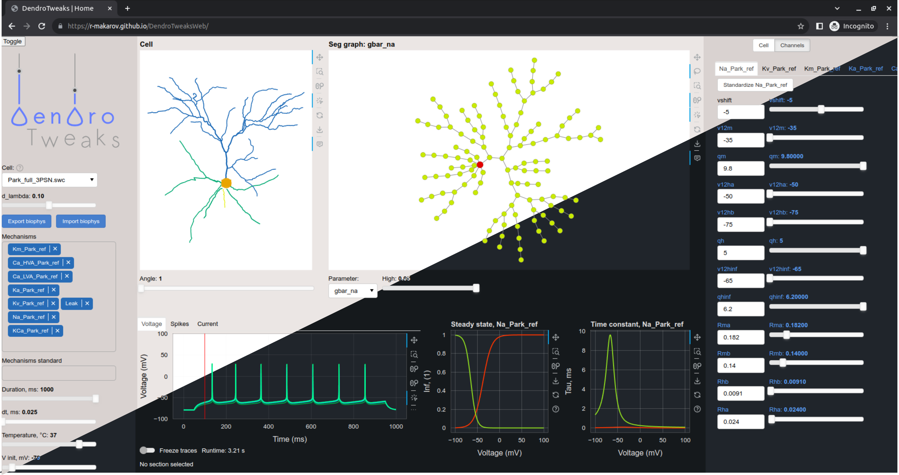

Using the GUI
=============

Accessing the GUI online
------------------------

The GUI can be accessed through a web browser by navigating to the
following URL: https://dendrotweaks.dendrites.gr

    *Figure 1: DendroTweaks GUI*

Installing the GUI locally
--------------------------

The GUI can be installed locally by cloning the DendroTweaks `GitHub repository <https://github.com/Poirazi-Lab/DendroTweaksApp>`_
using the following command:

.. code-block:: bash

    git clone https://github.com/Poirazi-Lab/DendroTweaksApp.git

