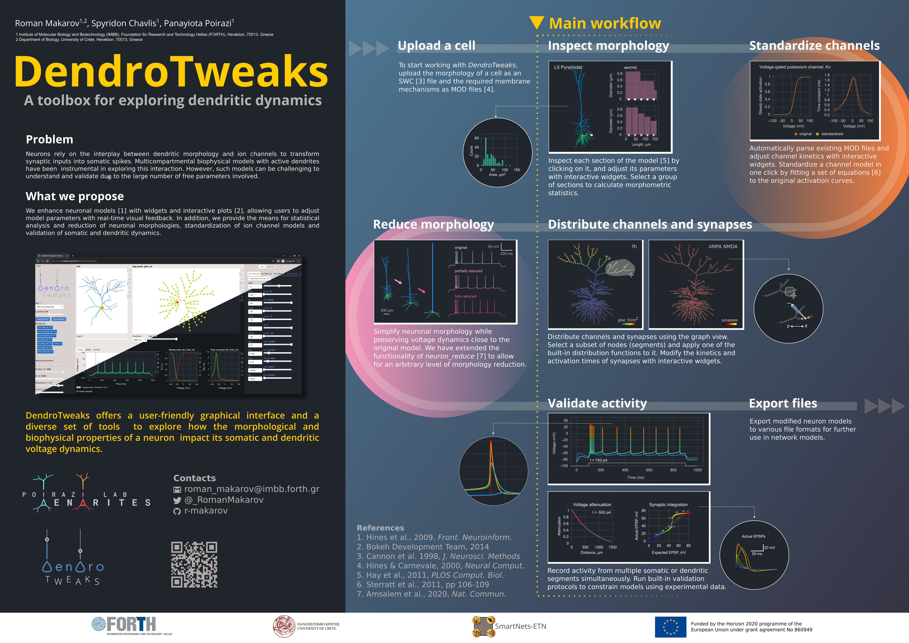

Introduction
==========================

Welcome to DendroTweaks documentation!

DendroTweaks is a Python toolbox designed to facilitate 
the creation and validation of single-cell biophysical neuronal models.

The toolbox is available both as a **standalone Python package** and as a **web-based application**.

The application's GUI can be accessed online at `dendrotweaks.dendrites.gr <https://dendrotweaks.dendrites.gr>`_.

To learn more about the GUI, please refer to the :doc:`GUI documentation<gui>`.

   
For a quick overview of the toolbox, including a video demonstration, you can visit our e-poster presented at the FENS Forum 2024 in Vienna.

.. admonition:: Citation 

   * Roman Makarov, Spyridon Chavlis, Panayiota Poirazi (2024). DendroTweaks: An interactive approach for unraveling dendritic dynamics. Science Communications World Wide. https://doi.org/10.57736/abba-7149

To learn more about the toolbox, you can read our publication in eLife.

.. admonition:: Citation 

   Roman Makarov, Spyridon Chavlis, Panayiota Poirazi (2024) DendroTweaks: An interactive approach for unraveling dendritic dynamics eLife 13:RP103324 https://doi.org/10.7554/eLife.103324.1

If you find DendroTweaks helpful for building your models, please consider citing our work.

.. code-block:: bibtex

   @article{Makarov2024,
         title={DendroTweaks: An interactive approach for unraveling dendritic dynamics},
         author={Makarov, Roman and Chavlis, Spyridon and Poirazi, Panayiota},
         journal={eLife},
         volume={13},
         pages={RP103324},
         year={2024},
         doi={10.7554/eLife.103324.1}
   }

.. toctree::
   :maxdepth: 1
   :caption: Getting started:

   self
   installation
   changelog

.. toctree::
   :maxdepth: 1
   :caption: Tutorials:

   gui
   tutorials/tutorial_quickstart
   basics
   advanced

.. toctree::
   :maxdepth: 1
   :caption: User guide:

.. toctree::
   :maxdepth: 1
   :caption: API Reference:

   api/morphology
   api/membrane
   api/stimuli
   api/core

.. toctree::
   :maxdepth: 1
   :caption: Useful resources:
      
   glossary
   literature
   support