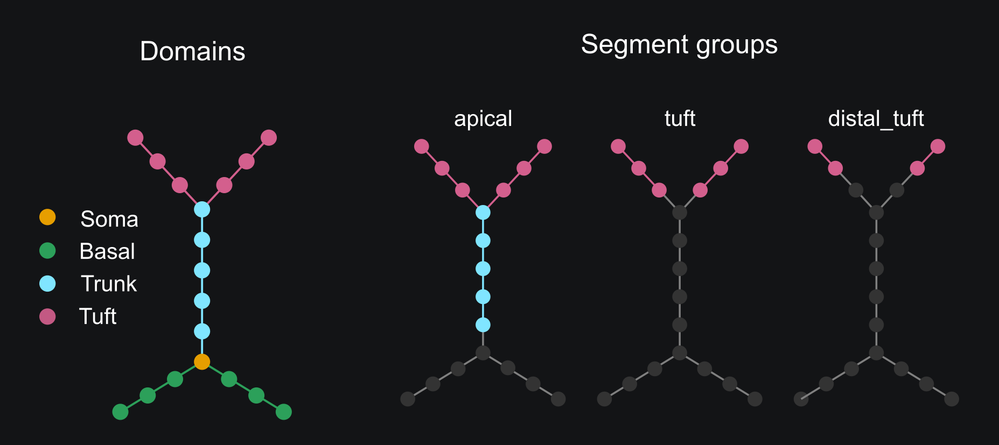
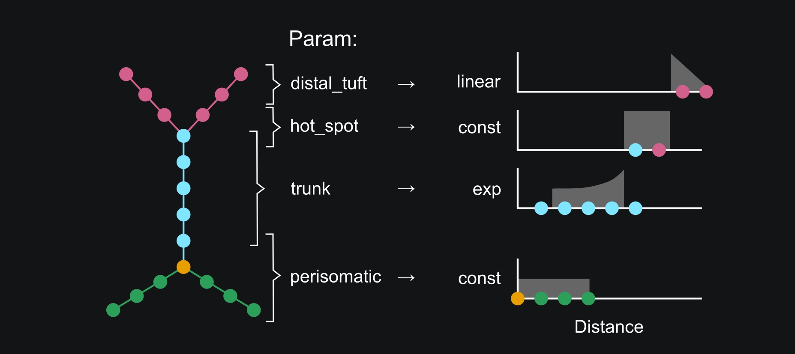
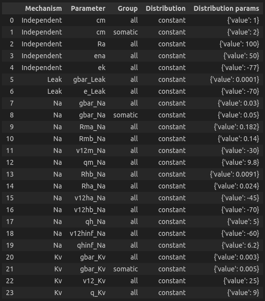
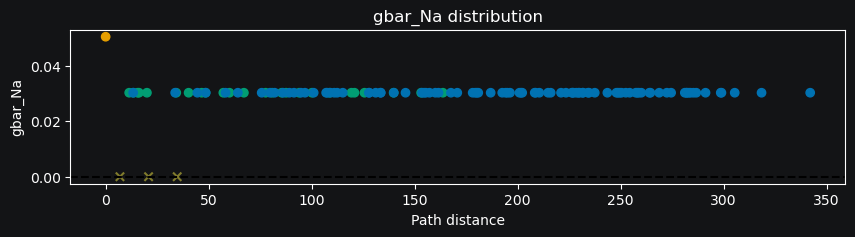

Distributing Parameters
==========================================

In this tutorial, we will learn how to distribute parameters across the cell.

In the quick start :doc:`tutorial</tutorials/tutorial_quickstart>`, we learned how to create a cell model and assign parameters 
to it. 
However, for many parameters, we need to set different values across various 
parts of the cell. Ion channels, for instance, are often distributed non-uniformly 
across the dendritic tree, with varying densities in different regions.

To implement this variation, we need to specify **where** and **how** the parameter will be distributed.
To select the segments **where** a given distribution will be applied, we will use the segment groups.
To define **how** the parameter will be distributed, we will use the distribution functions.
That is, we need to create segment groups and map them to different distribution functions. 

Where: Segment groups
------------------------------------------

A segment group is a collection of segments that meet certain criteria, 
such as the diameter or distance from the soma.
Let's dive deeper into the concept and 
first understand the difference between groups and domains.

Domains vs. groups
~~~~~~~~~~~~~~~~~~~

As we previously discussed, each neuron can be partitioned based on anatomical 
or functional criteria into non-overlapping regions called domains. 
In DendroTweaks, such partitioning ensures that each section is uniquely assigned 
to a single domain.

Similarily, segment groups, provide a way to select parts of the cell based 
on specific criteria. 
However, unlike domains 
segment groups can overlap, allowing segments to belong to multiple groups simultaneously.
Additionally, a segment group can divide a section, such that different segments 
within the same section may belong to different groups. 
For instance, the initial segments of a section might meet some distance criteria, 
while the end segments might not.

    *Figure 1: Domains vs. groups*

The figure above illustrates various examples of segment groups.
These groups can span across multiple domains (:code:`apical`), 
align with a single domain (:code:`tuft`), or select specific segments based on their 
diameter or distance from the soma—even dividing individual sections 
into different groups (:code:`distal_tuft`).

Accessing and adding segment groups
~~~~~~~~~~~~~~~~~~~~~~~~~~~~~~~~~~~~

We can access the segment groups of a model using the :code:`groups` attribute.

.. code-block:: python

    >>> model.groups
    {'all': SegmentGroup("all", domains=['soma', 'apic', 'axon', 'dend']),
     'somatic': SegmentGroup("somatic", domains=['soma']),
     'apical': SegmentGroup("apical", domains=['apic']),
     'axonal': SegmentGroup("axonal", domains=['axon']),
     'dendritic': SegmentGroup("dendritic", domains=['dend'])}

By default a group is created for each domain and the group :code:`all` is created for the entire cell. 

To define a new segment group, we must specify both a criterion 
and the domains where we will search for matching segments. 
The criterion can be one of three types: diameter, absolute distance (to the root of the tree), 
or relative distance within a domain. When no criterion is specified, 
the group automatically includes all segments from the selected domains.
Examples of group definitions are shown below:

.. code-block:: python

    >>> model.add_group('thin_apical', domains=['apic'], select_by='diameter', max_val=0.5)
    >>> model.add_group('proximal_dendritic', domains=['dend', 'apic'], select_by='abs_distance', max_val=100)
    >>> model.add_group('hot_spot', domains=['apic'], select_by='rel_distance', min_val=300, max_val=400)

Groups as layers
~~~~~~~~~~~~~~~~~

As we said, segment groups can overlap, therefore can be thought of as layers. In other words,
the order of groups is important, as the parameters will be assigned from the top-most group that the segment belongs to.
For example, if a segment belongs to both the 'all' and 'somatic' groups, and the 'somatic' group goes after the 'all' group in the list of groups,
then the 'somatic' group will take precedence and overwrite the values from the 'all' group.
We can use :code:`model.move_group_up` and :code:`model.move_group_down` methods to change the order of groups.

.. warning::

    Note that if a segment belongs to multiple groups the parameters will be assigned from the top-most of the groups.

This layer-based approach has several advantages. 
The most important one is that if a group of segments is removed, 
the segmnets will revert to the previous "layer" group which criteria they meet and
take the parameters from that group.

How: Distribution functions
------------------------------------------

Once we know the segments where we want to set a given parameter, 
we need to specify **how** we want to distribute it. To do so, we can
assign a distribution function that defines how the parameter value changes from segment to segment. 
The function takes as an argument the segment distance from the root of the tree 
and returns the value of the parameter at that segment.

    *Figure 2: Mapping from groups to distributions for a given parameter*

A distribution function takes as an argument the segment distance from the root of the tree 
and returns the value of the parameter at that segment.

.. math::

    f: \text{Distances} \rightarrow \text{Values}

The following distribution functions are available, along with their expected parameters:

- **constant**: Requires a `value` parameter.
- **linear**: Requires `slope` and `intercept` parameters.
- **exponential**: Requires `vertical_shift`, `scale_factor`, `growth_rate`, and `horizontal_shift` parameters.
- **sigmoid**: Requires `vertical_shift`, `scale_factor`, `growth_rate`, and `horizontal_shift` parameters.
- **sinusoidal**: Requires `amplitude`, `frequency`, and `phase` parameters.
- **gaussian**: Requires `amplitude`, `mean`, and `std` parameters.

Setting parameter distributions
~~~~~~~~~~~~~~~~~~~~~~~~~~~~~~~~~~~~~~~~~

To assign a distribution function to a group of segments 
for a given parameter, we can use the :code:`set_distribution` method. 
A few examples are shown below:

.. code-block:: python

    >>> model.set_param('cm', group_name='all', distr_type='constant', value=1)
    >>> model.set_param('cm', group_name='somatic', distr_type='constant', value=2)
    >>> model.set_param('gbar_Kv', group_name='all', distr_type='constant', value=0.005)
    >>> model.set_param('gbar_Kv', group_name='apical', distr_type='linear', intercept=0.005, slope=-0.0001)
    >>> model.set_param('gbar_CaLVA', group_name='apical', distr_type='constant', value=0.0001)
    >>> model.set_param('gbar_CaLVA', group_name='hot_spot', distr_type='gaussian', amplitude=0.002, mean=350, std=10)

We can utilized a more concise notation if a parameter does not vary across the cell.
If we don't provide a group name, the parameter will be set for all segments.
If we don't provide a distribution type, the parameter will be set using a constant distribution.
The two examples below are equivalent:

.. code-block:: python

    >>> model.set_param('gbar_Leak', value=0.0001) # S/cm^2
    >>> model.set_param('gbar_Leak', group_name='all', distr_type='constant', value=0.0001) # S/cm^2

For the majority of models, non-uniform distribution is needed only for 
conductances of ion channels.
However, we can distribute any parameter using the same approach.
For instance, if we need to distribute the 
reversal potential or the half-activation voltage of a channel, 
we can do so by defining the appropriate distribution functions 
and assigning them to the relevant segment groups.

.. code-block:: python

    >>> model.set_param('e_Kv', group_name='all', distr_type='constant', value=-90)
    >>> model.set_param('e_Kv', group_name='apical', distr_type='linear', intercept=-90, slope=0.01)
    >>> model.set_param('vhalf_n_Kv', group_name='all', distr_type='linear', intercept=-30, slope=-0.001)

We can access the parameters and their distributions using the :code:`params` attribute of the model.

.. code-block:: python

    >>> model.params['cm']
    {'all': constant({'value': 1}), 'somatic': constant({'value': 2})}

For a more neat representation, we can use the :code:`df_params` property:

.. code-block:: python

    >>> model.df_params
    

    
We can also plot the distribution of a parameter 
as a function of the distance from the soma using the :code:`plot_param` method
for visual inspection.

.. code-block:: python

    >>> model.plot_param('gbar_Na')

    