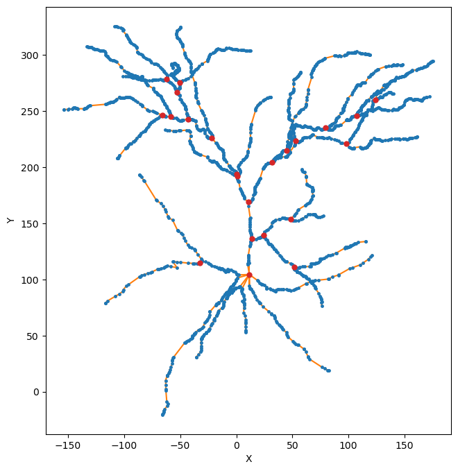

Neuronal morphologies
==========================================

What are SWC files?
-------------------

SWC files are a standard format for representing neuronal morphologies. They consist of a series of lines, each describing a point in the neuron with specific attributes. Below is an example of an SWC file represented as a table:

.. table:: Example SWC File
    :widths: 10 10 10 10 10 10 10
    :align: center

    +-------+------+-------+-------+-------+-------+--------+
    | Index | Type |   X   |   Y   |   Z   |   R   | Parent |
    +=======+======+=======+=======+=======+=======+========+
    |   1   |   1  |  0.0  |  0.0  |  0.0  |  1.0  |   -1   |
    +-------+------+-------+-------+-------+-------+--------+
    |   2   |   3  |  0.0  |  1.0  |  0.0  |  0.5  |    1   |
    +-------+------+-------+-------+-------+-------+--------+
    |   3   |   3  |  1.0  |  1.0  |  0.0  |  0.5  |    2   |
    +-------+------+-------+-------+-------+-------+--------+

Each line in an SWC file contains the following fields:

- **Index**: Sample identifier. A sequential positive integer.
- **Type**: Type identifier. A positive integer:
    - 0: Structure type unknown or unspecified
    - 1: Soma of a neuron
    - 2: Axon of a neuron
    - 3: Basal dendrite of a neuron
    - 4: Apical dendrite of a neuron
    - 5: Custom type of cell component
    - 6: An unspecified part of a neuron
    - 7: Glial processes
    - >7: Custom type of cell component
- **X**: X-position in micrometers.
- **Y**: Y-position in micrometers.
- **Z**: Z-position in micrometers.
- **R**: Radius in micrometers (half the node thickness).
- **Parent**: Parent sample identifier.

For more details, refer to the `SWC specification <https://swc-specification.readthedocs.io/en/latest/swc.html>`_.

Representing morphologies in DendroTweaks
---------------------------------------------

In DendroTweaks, neuronal morphologies are represented as tree graphs. 
A single neuron can be represented in three distinct forms: the SWC tree, the section tree, and the segment tree.
Each tree is composed of nodes that correspond to points in the SWC file, sections, and segments, respectively.
The edges in these trees denote the parent-child relationships between the nodes.
These trees represent three levels of abstraction: geometry (SWC tree), topology (section tree), and spatial discretization (segment tree).
All three representations are linked to each other, since each section has a reference to its geometry (SWC points) and its segmentation (Segments).

.. table:: Neuronal Morphology Representations
    :widths: 20 40 40
    :align: center

    +-------------------------+-----------------------------+------------------------------------------------------------+
    | Abstraction Level       | Representation              | Description                                                |
    +=========================+=============================+============================================================+
    | Geometry                | SWC Tree (SWC nodes)        | Represents geometrical properties such as coordinates and  |
    |                         |                             | radii.                                                     |
    +-------------------------+-----------------------------+------------------------------------------------------------+
    | Topology                | Section Tree (sections)     | Represents the parent-child relationships between sections.|
    +-------------------------+-----------------------------+------------------------------------------------------------+
    | Spatial discretization  | Segment Tree (segments)     | Represents the discretization of sections into segments.   |
    +-------------------------+-----------------------------+------------------------------------------------------------+

The figure below illustrates the relationship between the three representations:

.. figure:: ../_static/trees.png
    :align: center
    :width: 80%
    :alt: Representing morphologies as tree graphs

    *Figure 1: Representing morphologies as tree graphs*

Creating a morphology from an SWC file
------------------------------------------------

DendroTweaks provides a shortcut for creating a morphology from an SWC file that we have already seen in the first :doc:`tutorial</tutorials/tutorial_quickstart>`. You can use the :code:`from_swc` method to create a morphology from an SWC file:

.. code-block:: python

    >>> model.from_swc('path/to/swc_file.swc')

This method automatically sorts the points, splits them into sections, extends the sections, and shifts and rotates the morphology to a standard orientation.
The trees are then stored in the :code:`model` object for further processing.

.. code-block:: python
    
        >>> model.swc_tree, model.sec_tree
        <dendrotweaks.morphology.SWCTree at 0x7f8b3b3b3b50>

We can visualize the tree using the :code:`plot` method.

.. code-block:: python

    fig, ax = plt.subplots(figsize=(8, 8))
    model.swc_tree.plot(ax, edges=True, projection='XY', 
                        annotate=False, highlight=swc_tree.bifurcations)

    *Figure 2: Visualizing the SWC tree (SWC nodes — blue, edges - orange, bifurcations - red)*

Nodes and their properties
--------------------------------

Each node (point) in the SWC tree has the following properties:

.. code-block:: python

    >>> pt = model.swc_tree.pts3d[0]
    >>> pt.idx, pt.type, pt.x, pt.y, pt.z, pt.r, pt.parent
    (1, 1, 0.0, 0.0, 0.0, 1.0, -1)

The SWC tree also provides methods to access the parent and children of a node.
In addition, it provides methods to access the domain of the node and
calculate the path lenght distance to the root node.

.. code-block:: python

    >>> pt.domain, pt.path_distance()
    ('soma', 0.0)
    

Each section in the section tree has the following properties:

.. code-block:: python

    >>> sec = model.sec_tree.sections[17]
    >>> sec.idx, sec.type, sec.parent, sec.children
    (1, 1, None, [2, 3])

The section's geometry can be visualized using the :code:`plot_pts3d` method.

.. code-block:: python

    >>> fig, ax = plt.subplots(2, 2, figsize=(6, 6))
    >>> sec.plot(ax=ax, plot_parent=True, remove_ticks=True)
    >>> plt.tight_layout()

.. figure:: ../_static/sec_extended.png
    :align: center
    :width: 50%
    :alt: Visualizing the section tree

    *Figure 3: Visualizing the section tree (section — blue, parent - orange)*

Section tree
----------------

To visualize the section tree, use the :code:`plot` method.

.. code-block:: python

    >>> fig, ax = plt.subplots(figsize=(8, 8))
    >>> model.sec_tree.plot(ax=ax, show_points=True, 
    ...                     show_lines=True, annotate=True)

.. figure:: ../_static/sec_tree.png
    :align: center
    :width: 50%
    :alt: Visualizing the section tree

    *Figure 4: Visualizing the section tree*

For more details on working with neuronal morphologies in DendroTweaks, refer to the :doc:`tutorial</tutorials/tutorial_swc>` on refining neuronal morphology.

Creating the segmentation tree requires us to set the passive properties of the sections. 
Therefore in the next tutorial we will discuss how we can define properties in our model.

