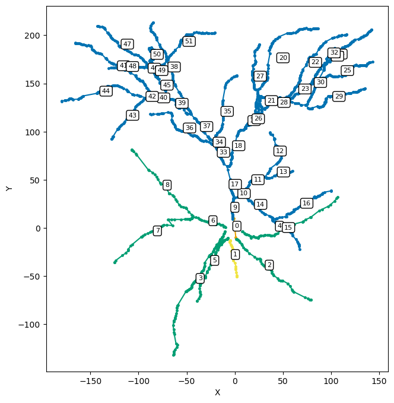
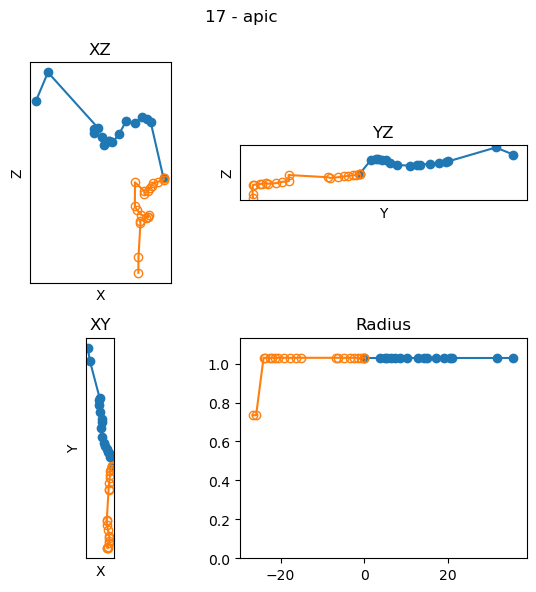

Neuronal morphologies
==========================================

In this tutorial, we will discuss how to represent neuronal morphologies in DendroTweaks.
You will learn about SWC files, the three representations of neuronal morphologies in DendroTweaks,
and how to create a morphology from an SWC file.

What are SWC files?
-------------------

SWC files are a standard format for representing neuronal morphologies. They consist of a series of lines, each describing a point in the neuron with specific attributes. Below is an example of an SWC file represented as a table:

.. table:: Example SWC File
    :widths: 10 10 10 10 10 10 10
    :align: center

    +-------+------+-------+-------+-------+-------+--------+
    | Index | Type |   X   |   Y   |   Z   |   R   | Parent |
    +=======+======+=======+=======+=======+=======+========+
    |   1   |   1  |  0.0  |  0.0  |  0.0  |  1.0  |   -1   |
    +-------+------+-------+-------+-------+-------+--------+
    |   2   |   3  |  0.0  |  1.0  |  0.0  |  0.5  |    1   |
    +-------+------+-------+-------+-------+-------+--------+
    |   3   |   3  |  1.0  |  1.0  |  0.0  |  0.5  |    2   |
    +-------+------+-------+-------+-------+-------+--------+

Each line in an SWC file contains the following fields:

- **Index**: Sample identifier. A sequential positive integer.
- **Type**: Type identifier. A positive integer:
    - 0: Structure type unknown or unspecified
    - 1: Soma of a neuron
    - 2: Axon of a neuron
    - 3: Basal dendrite of a neuron
    - 4: Apical dendrite of a neuron
    - 5: Custom type of cell component
    - 6: An unspecified part of a neuron
    - 7: Glial processes
    - >7: Custom type of cell component
- **X**: X-position in micrometers.
- **Y**: Y-position in micrometers.
- **Z**: Z-position in micrometers.
- **R**: Radius in micrometers (half the node thickness).
- **Parent**: Parent sample identifier.

For more details, refer to the `SWC specification <https://swc-specification.readthedocs.io/en/latest/swc.html>`_.

Representing morphologies in DendroTweaks
---------------------------------------------

In DendroTweaks, neuronal morphologies are represented as tree graphs. 
A single neuron can be represented in three distinct forms: the point tree, the section tree, and the segment tree.
Each tree is composed of nodes that correspond to points in a morphology reconstruction (SWC file), sections, and segments, respectively.
The edges in these trees denote the parent-child relationships between the nodes.
These trees represent three levels of abstraction: geometry (point tree), topology (section tree), and spatial discretization (segment tree).
All three representations are linked to each other, since each section has a reference to its geometry (:code:`points`) and its segmentation (:code:`segments`).

.. table:: Neuronal Morphology Representations
    :widths: 20 40 40
    :align: center

    +-------------------------+-----------------------------+------------------------------------------------------------+
    | Abstraction Level       | Representation              | Description                                                |
    +=========================+=============================+============================================================+
    | Geometry                | Point Tree (points)         | Represents geometrical properties such as coordinates and  |
    |                         |                             | radii.                                                     |
    +-------------------------+-----------------------------+------------------------------------------------------------+
    | Topology                | Section Tree (sections)     | Represents the parent-child relationships between sections.|
    +-------------------------+-----------------------------+------------------------------------------------------------+
    | Spatial discretization  | Segment Tree (segments)     | Represents the discretization of sections into segments.   |
    +-------------------------+-----------------------------+------------------------------------------------------------+

The figure below illustrates the relationship between the three representations:

.. figure:: ../_static/trees.png
    :align: center
    :width: 80%
    :alt: Representing morphologies as tree graphs

    *Figure 1: Representing morphologies as tree graphs*

Creating a morphology from an SWC file
------------------------------------------------

As an alternative to manually instantiating each tree graph, 
DendroTweaks provides a shortcut for creating a morphology from an SWC file
that we have already seen in the quickstart :doc:`tutorial</tutorials/tutorial_quickstart>`. 

First, we list the available morphologies in the morphology folder.

.. code-block:: python

    >>> model.list_morphologies()
    ['cell']

We can use the :code:`load_morphology` method to create a morphology from an SWC file:

.. code-block:: python

    >>> model.load_morphology('cell')

This method automatically sorts the points, 
splits them into sections, and standardizes the morphology.
The trees are then stored in the :code:`model` object for further processing.

.. code-block:: python
    
    >>> model.sec_tree
    Tree [••0, ••1, ••2, ••3, ••4, ••5, ••6, ...]

.. code-block:: python

    >>> from dendrotweaks.morphology import validate_tree
    >>> validate_tree(model.sec_tree)
    Tree validation passed successfully

Note that validation of a section tree involves validation of 
the corresponding SWC and segment trees as well.

Besides automatic validation, we can visualize the tree using the :code:`plot` method.

.. code-block:: python

    >>> fig, ax = plt.subplots(figsize=(10, 10))
    >>> model.sec_tree.plot(ax, show_points=True, show_lines=True, 
    ...             annotate=True, projection='XY', domains=True)

    *Figure 2: Visualizing the section tree (sections are annotated with their indexes)*

.. code-block:: python

    >>> model.sec_tree.topology()
    parent |   idx
    ---------------
        -1 |   •0
         0 |   ├─•1
         0 |   ├─•2
         0 |   ├─•3
         0 |   ├─•4
         0 |   ├─•5
         0 |   ├─•6
         6 |   │ ├─•7
         6 |   │ └─•8
         0 |   └─•9
         9 |     ├─•10
        10 |     │ ├─•11
        11 |     │ │ ├─•12
        11 |     │ │ └─•13
        10 |     │ └─•14
        14 |     │   ├─•15
        14 |     │   └─•16
         9 |     └─•17
        ...
    
Tree nodes and their properties
--------------------------------

Points, sections, and segments are all nodes in the tree graphs, and they share common properties and methods.
We will select a section from the section tree and explore its properties.

.. code-block:: python

    >>> sec = model.sec_tree.sections[11]
    >>> sec.idx, sec.parent_idx
    (11, 10)

The section's parent and children are references to the parent and children sections, respectively.
The root of the tree is the only section without a parent (None).

.. code-block:: python

    >>> sec.parent, sec.children
    (••10, [••12, ••13])

The subtree of a section is a list of sections that contains the section itself and all its descendants.

.. code-block:: python

    >>> sec.subtree
    [••11, ••13, ••12]

.. note::

    Note that these topological attributes and properties are common for 
    any type of a tree node whether it is a section, point, or segment.
    Below, we will explore properties specific to each type.

Section geometry
~~~~~~~~~~~~~~~~~~~~~~~~~

Besides the topological properties, the section has a geometry that is represented by the points that define it.

.. code-block:: python

    >>> sec.points
    [•427, •428, •429, •430, ...]

Each point is a node in the corresponding point tree that has 
additional properties such as coordinates and radii.

.. code-block:: python

    >>> pt = sec.points[0]
    >>> pt.domain, pt.x, pt.y, pt.z, pt.r
    ('apic', 9.074, 36.225, 4.2, 0.365)

We can calculate the (cumulative) euclidean distances between the points of the section.

.. code-block:: python

    >>> sec.distances
    [0.0, 2.508, 2.968, 5.034, ..., 34.876]

From the distances, we get the length of the section as the final element in the list.

.. code-block:: python

    >>> sec.length
    34.876

The section's geometry can be visualized using the :code:`plot` method.

.. code-block:: python

    >>> sec = model.sec_tree[22]
    >>> fig, ax = plt.subplots(2, 2, figsize=(12, 6))
    >>> sec.plot(ax=ax, plot_parent=True)
    >>> plt.tight_layout()

    *Figure 3: Visualizing a section (section — blue, parent - gray)*

In addition to the shape of the section, we can calculate the path distance 
from a given point of the section to the root of the tree, 
which will become extremely important when we will
distribute biophysical properties along the morphology.

.. code-block:: python

    >>> sec.path_distance(0, within_domain=False)
    40.787

To calculate the distance only within a given domain 
(e.g., for an oblique dendrite up to the place it meets the trunk, 
instead of all the way to the soma),
we can pass the :code:`within_domain` parameter as True.

Section segmentation
~~~~~~~~~~~~~~~~~~~~~~~~~~~~~~~

Our custom section object acts as a wrapper around the simulator's object 
(for details see the :doc:`tutorial</tutorials/tutorial_referencing>`).
To access the corresponding section object in the NEURON simulator, 
we can use the :code:`_ref` attribute.

.. code-block:: python

    >>> sec._ref
    __nrnsec_0x2dcd5c10

In order to perform simulations, we need to discretize the sections 
into segments.

.. code-block:: python

    >>> sec.segments
    [•51]

As in NEURON, sections are callable objects that return 
the segment which center is closest to the given normalized distance.

.. code-block:: python

    >>> seg = sec(0.5)
    >>> seg.idx, seg.x
    (51, 0.5)

The segment object has the following properties:

.. code-block:: python

    >>> seg._ref
    __nrnsec_0x2dcd5c10(0.5)

For more details on working with neuronal morphologies in DendroTweaks,
refer to the :doc:`tutorial</tutorials/tutorial_swc>` on refining neuronal morphology.

The segmentation tree highly depends on the passive properties of the sections. 
Therefore, in the next tutorial, we will discuss how we can set and update model parameters
including membrane capacitance and axial resistance.
We will return to the segmentation tree in :doc:`one</tutorials/tutorial_segmentation>` of the following tutorials, 
where we will discuss how to set the spatial discretization of the model.
