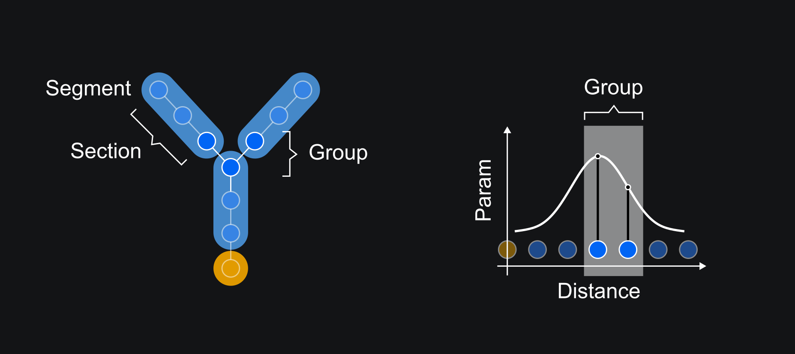

Quick Start
==========================================

This tutorial will guide you through the basic steps of creating 
a single-cell biophysical neuronal model in DendroTweaks.

Create a model
------------------------------------------

First, we create a model object and specify the path to the folder with the data.

.. code-block:: python

    >>> import dendrotweaks as dd
    >>> model = dd.Model(name='UserModel', path_to_data='path/to/data/')

The subfolders of the data folder should follow the structure below wich we can
see using the :code:`model.print_directory_tree()` method.

.. code-block:: bash

    .
    └── data/
        ├── Default/
        |  ├── Leak.mod
        |  ├── AMPA.mod
        |  ...
        ├── Templates/
        |  ├── channel.py
        |  └── standard_channel.mod
        └── UserModel/
            ├── morphology/
            │   └── cell.swc
            └── mod/
                ├── Nav.mod
                └── Kv.mod

More on the directory structure and how to load existing models you can learn in the :doc:`tutorial</tutorials/tutorial_io>` on loading and saving models.

Load the morphology
------------------------------------------

We proceed by loading the morphology of the cell from an SWC file.
First, we list the available morphologies in the morphology folder.

.. code-block:: python

    >>> model.list_morphologies()
    ['cell']

We can load the morphology of the cell using the :code:`load_morphology` method.

.. code-block:: python

    >>> model.load_morphology('cell')

We now have access to :code:`point_tree`, :code:`sec_tree` and :code:`seg_tree`
attributes of the model object.

.. code-block:: python

    >>> model.point_tree
    >>> model.sec_tree
    >>> model.seg_tree

More on the representation of the neuronal morphology with tree graphs in the :doc:`tutorial</tutorials/tutorial_morpho>`.

.. warning::

    Note that the spatial discretization of the model (i.e. the :code:`seg_tree`) depends on 
    the specific membrane capacitance :code:`cm` and axial resistance :code:`Ra` of the cell.
    By default, these parameters are set to NEURON's default values.
    To learn how to change the spatial discretization of the model refer to the 
    :doc:`tutorial</tutorials/tutorial_segmentation>` on setting the spatial discretization of the model.

Add mechanisms
------------------------------------------

After defining the neuronal morphology, we should proceed with 
specifying its biophysical properties.
Biophysical properties of the model depend on the membrane mechanisms
that are present in the membrane.
These mechanisms are defined in MOD files as a set of equations and their parameters, which are compiled and loaded into NEURON.

We will add the default mechanisms to the model wich include the leak channel and synaptic mechanisms.

.. code-block:: python

    >>> model.add_default_mechanisms(recompile=False)

We can see the available mechanisms with the :code:`list_mechanisms` method.

.. code-block:: python

    >>> model.list_mechanisms()
    ['Nav', 'Kv']

Next we will add user-defined mechanisms to the model and distribute their parameters across the cell.

.. code-block:: python

    >>> for mech in model.list_mechanisms():
    >>>     model.add_mechanism(mech, recompile=True)

With this commands we create python objects from MOD files, adding them to :code:`model.mechanisms`.
We also compile MOD files and make them available in NEURON.

We can see the mechanisms available in the model with the :code:`mechanisms` attribute.

.. code-block:: python

    >>> model.mechanisms
    {'Leak': <Mechanism(Leak)>,
     'Nav': <Mechanism(Nav)>,
     'Kv': <Mechanism(Kv)>}

We can see the parameters of the mechanisms with the :code:`params` attribute.

.. code-block:: python

    >>> model.mechanisms['Leak'].params
    {'gbar': 0.0, 'e': -70}

.. warning::

    Note that the parameters stored within the mechanisms are the default values from the MOD files.
    The actual values of the parameters used for the simulation are stored in the model object!

We can see the parameters of the mechanisms in the model with the :code:`params` attribute.

.. code-block:: python

    >>> model.params
    {'cm': {'all': constant({'value': 1})},
     'Ra': {'all': constant({'value': 35.4})}}

We should interpret the output as follows: the specific membrane capacitance :code:`cm` is set to a constant value of 1 uF/cm^2,
and the axial resistance :code:`Ra` is set to 35.4 Ohm*cm for all segments of the cell. We will discuss how to update these parameters in a bit.
We will learn more about segment groups and parameter distributions in the
:doc:`tutorial</tutorials/tutorial_distributions>` on distributing parameters across the cell.

.. warning::

    Note that so far we have only loaded the mechanisms without actually inserting them 
    into the membrane. Therefore, the parameters of the mechanisms are not yet included in the :code:`params` dictionary.
    In the next step we will insert the mechanisms into the membrane.

Insert mechanisms to specific domains
------------------------------------------

In DendroTweaks membrane mechanisms are mapped to the morhological domains.
A domain is a region of a neuron distinguished by its anatomical 
or functional properties. 
In a typical pyramidal cell model we have the following domains:
soma, axon, basal dendrites, apical dendrite (further subdivided to trunk, tuft and oblique dendrites).

.. figure:: ../_static/domains2.png
    :align: center
    :width: 80%
    :alt: Domains of a pyramidal cell

    *Figure 1: Domains of a pyramidal cell*

In DendroTweaks a domain represents a collection of sections that share the same properties.
We can see the domains of the model with the :code:`domains` attribute.

.. code-block:: python

    >>> model.domains
    {'soma': <Domain(soma, 1 sections)>,
     'apic': <Domain(apic, 43 sections)>,
     'axon': <Domain(axon, 1 sections)>,
     'dend': <Domain(dend, 7 sections)>}

In the previous step we uploaded the mechanisms, now we want to actually insert them into the specific domains.
In this example we simply insert each of the three avaliable mechanisms to all domains. However, we could insert some mechanisms only to the soma,
or only to the apical dendrite, etc.

.. code-block:: python

    >>> all_domains = ['soma', 'dend', 'axon', 'apic']
    >>> for domain in all_domains:
    >>>     model.insert_mechanism('Leak', domain)
    >>>     model.insert_mechanism('Nav', domain)
    >>>     model.insert_mechanism('Kv', domain)

We can see the mechanisms inserted in any domain with the :code:`domains_to_mechs` attribute.

.. code-block:: python

    >>> model.domains_to_mechs
    {'soma': ['Leak', 'Nav', 'Kv'],
     'apic': ['Leak', 'Nav', 'Kv'],
     'axon': ['Leak', 'Nav', 'Kv'],
     'dend': ['Leak', 'Nav', 'Kv']}

And we can see the parameters of the mechanisms inserted in the model with the :code:`mechs_to_params` attribute.

.. code-block:: python

    >>> model.mechs_to_params
    {'Independent': ['cm', 'Ra', 'ena', 'ek'],
     'Leak': ['gbar_Leak', 'e_Leak'],
     'Nav': ['gbar_Nav', 'vhalf_m_Nav', ...],
     'Kv': ['gbar_Kv', 'vhalf_n_Kv' ...]}

Some parameters, such as specific membrane capacitance :code:`cm` and axial resistance :code:`Ra`, do not belong to any mechanism.
Such independent parameters are combined under "Independent" pseudo-mechanism for consistency of the interface.
These parameters are avaliable in each domain by default.

At this point we have inserted the mechanisms into the membrane and set the default parameters for the model.
We can see the parameters of the mechanisms inserted in the model with the :code:`params` attribute.

.. code-block:: python

    >>> model.params
    {'cm': {'all': constant({'value': 1})},
     'Ra': {'all': constant({'value': 35.4})},
     'gbar_Leak': {'all': constant({'value': 0.0})},
     'e_Leak': {'all': constant({'value': -70})},
     'gbar_Nav': {'all': constant({'value': 0.0})},
     'vhalf_m_Nav': {'all': constant({'value': -30}),
     ...
     'ena': {'all': constant({'value': 50}),
     'gbar_Kv': {'all': constant({'value': 0.0})},
     'vhalf_n_Kv': {'all': constant({'value': -35})},
     ...
     'ek': {'all': constant({'value': -77})},
     }

As we can see, all the parameters are set to their default value across all segments of the cell, and for some 
of the parameters the value is 0.0. We need to set the values of the parameters to the desired, more realisitc
values before running the simulation and we will learn how to do that in the next step.

Set model parameters
------------------------------------------

We can set the value of a parameter using the :code:`set_param` method.
As an example, let's set the conductance of the leak channel to 0.0001 S/cm^2.

.. code-block:: python

    >>> model.set_param('gbar_Leak', value=0.0001) # S/cm^2

That being said, in real neurons, some properties, such as the conductance of ion channels, can vary across different regions of the cell. 
To distribute parameters across the cell, we need to specify **where** and **how** the parameter will be distributed.

To select the segments **where** a given distribution will be applied, we will use the segment groups.
A segment group is a collection of segments that meet certain criteria, 
such as the diameter or distance from the soma.

To define **how** the parameter will be distributed, we will use the distribution functions.
A distribution function is a function that takes segment's distance from the soma as an input
and returns the value of the parameter at that distance. The figure below schematically shows an example 
of a segment group for the apical nexus region and a Gaussian distribution function for a parameter, such as ion channel conductance.

    *Figure 1: Distribution of parameters across the cell*

We can set the value of the parameters of the mechanisms inserted in the model using the :code:`set_param` method
by specifying the group name and the distribution type.

.. code-block:: python

    >>> model.set_param('gbar_Nav', group_name='all', distr_type='constant', value=0.03)  
    >>> model.set_param('gbar_Nav', group_name='somatic', distr_type='constant', value=0.05) #
    >>> model.set_param('gbar_Kv', group_name='all', distr_type='constant', value=0.003) 
    >>> model.set_param('gbar_Kv', group_name='somatic', distr_type='constant', value=0.005)
    
We can utilized a more concise notation if a parameter does not vary across the cell.
If we don't provide a group name, the parameter will be set for all segments.
If we don't provide a distribution type, the parameter will be set using a constant distribution.
The two examples below are equivalent:

.. code-block:: python

    >>> model.set_param('gbar_Leak', value=0.0001) # S/cm^2
    >>> model.set_param('gbar_Leak', group_name='all', distr_type='constant', value=0.0001) # S/cm^2

We can set other parameters, such as reversal potentials, temperature, and initial membrane potential.

.. code-block:: python

    >>> model.set_param('e_Leak', value=-70) # mV
    >>> model.set_param('e_k', value=-80) # mV
    >>> model.set_param('e_na', value=60) # mV
    >>> model.set_param('temperature', value=37) # degC
    >>> model.set_param('v_init', value=-70) # mV

Now, we can access the model parameters again and see that the values have been updated.

.. code-block:: python

    >>> model.params
    {'cm': {'all': constant({'value': 1})},
     'Ra': {'all': constant({'value': 35.4})},
     'gbar_Leak': {'all': constant({'value': 0.0001})},
     'e_Leak': {'all': constant({'value': -70})},
     'gbar_Nav': {'all': constant({'value': 0.03}),
                  'somatic': constant({'value': 0.05})},
     'vhalf_m_Nav': {'all': constant({'value': -30}),
     ...
     'ena': {'all': constant({'value': 50}),
     'gbar_Kv': {'all': constant({'value': 0.003}),
                 'somatic': constant({'value': 0.005})},
     'vhalf_n_Kv': {'all': constant({'value': -35})},
     ...
     'ek': {'all': constant({'value': -77})},
     }

To learn more about segment groups and parameter distributions, refer to the
:doc:`tutorial</tutorials/tutorial_distributions>` on distributing parameters.

Add stimuli and run a simulation
------------------------------------------

We will add a current clamp stimulus to the soma and record the somatic membrane potential.

First, we select the soma section of the model.

.. code-block:: python

    >>> soma = model.get_sections(lambda sec: sec.domain == 'soma')[0]

Next, we add a recording point at the center of the soma. 
The :code:`loc` parameter specifies the location along the section 
where the recording will be placed. 
It is a normalized length, with 0.0 representing the start of the section 
and 1.0 representing the end.

.. code-block:: python

    >>> model.add_recording(sec=soma, loc=0.5)

Then, we add a current clamp stimulus to the center of the soma.
We specify the duration of the stimulus in ms, the delay before the stimulus starts, and the amplitude of the stimulus
in pikoAmperes.

.. code-block:: python

    >>> model.add_iclamp(sec=soma, loc=0.5, dur=100, delay=100, amp=150)

Now we are ready to run the simulation.

.. code-block:: python

    >>> t, v, _ = model.run(300) # ms

For more complex stimuli, such as synaptic inputs, refer to the :doc:`tutorial</tutorials/tutorial_synapses>`.

Analyze the results
------------------------------------------

Finally, we can analyze the results of the simulation using some of the built-in functions in DendroTweaks.

.. code-block:: python

    >>> voltage_trace = model.simulator.recordings[0]
    >>> spike_data = dd.validation.count_spikes(voltage_trace)

More on this in the :doc:`tutorial</tutorials/tutorial_validation>` on analyzing simulation results.