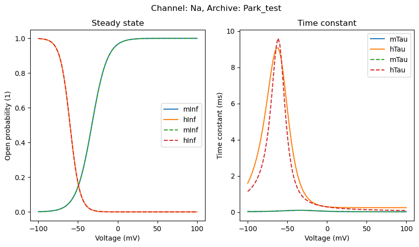
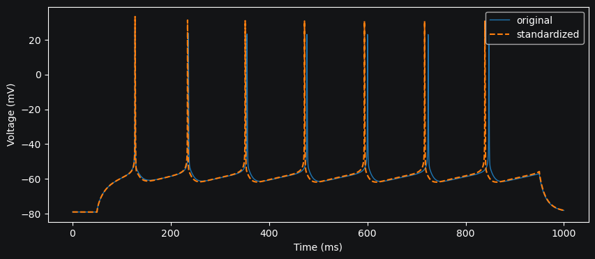

Standardizing channel models
==========================================

.. warning::

    Only voltage-gated ion channels with Hodgkin-Huxley formalism
    can be standardized. The standardization process is not applicable to other mechanisms.

DendroTweaks provides a simple way to standardize voltage-gated ion channel models.
In the previous :doc:`tutorial </tutorials/tutorial_mod>`, we learned how to load and create ion channels from MOD files.

A standard channel can be created directly from a MOD file.
This method can be used to convert the original MOD file to a standard channel model as it exports the standard channel to a MOD file
using the specified template.

.. code-block:: python

    >>> from dendrotweaks.membrane.io import create_standard_channel
    >>> std_nav = create_standard_channel(
    ...     path_to_mod_file='path/to/original/mod/file',
    ...     path_to_python_file='path/to/python/file',
    ...     path_to_python_template='path/to/python/template',
    ...     path_to_mod_template='path/to/mod/template',
    ...     path_to_standard_mod_file='path/to/standard/mod/file',
    ... )

If we already have an instance of a custom channel created before and we 
want to standardize it, we can use the :code:`standardize_channel` function.

.. code-block:: python

    >>> from dendrotweaks.membrane.io import standardize_channel
    >>> standardize_channel(
    ...     custom_channel,
    ...     path_to_mod_template='path/to/mod/template',
    ...     path_to_standard_mod_file='path/to/standard/mod/file'
    ... )

Assuming that we have an instance of a model with a custom sodium channel `Na` created before,
we can standardize it with :code:`model.standardize_channel` method.
The standard channel with the name `sNa` (standard-Na) and very similar kinetics to the original channel model
is created to replace the original channel model.
This method also exports the standard channel model to a MOD file which is immediately loaded into the NEURON simulator.

.. code-block:: python

    >>> fig, ax = plt.subplots(1, 2, figsize=(10, 5))
    >>> model.mechanisms['Na'].plot_kinetics(ax=ax)
    >>> model.standardize_channel('Na', remove_old=True)
    >>> model.mechanisms['sNa'].plot_kinetics(ax=ax, linestyle='--')

    *Figure 1: Visualization of channel kinetics (dashed lines represent the standard channel)*
    
We can also plot the voltage trace of the standard channel model 
to compare it with the trace produced by the original channel model.

    *Figure 2: Voltage trace of the standard channel model (dashed line represents the standard channel)*
    

How does it work?
-------------------------------------------------------------

Below we provide a brief overview of the standardization process for voltage-gated ion channels.

The standardization process is based on the Hodgkin-Huxley formalism, which describes the dynamics of ion channels.
The Hodgkin-Huxley model is a system of ordinary differential equations that describes the behavior of voltage-gated ion channels.
The model consists of a set of state variables that represent the open probability of the channel and the time constants of the channel kinetics.

We can derive kinetic curves (shown in Figure 1) from the 
model equations. 
The curves represent the steady-state open probability and 
the time constant of the channel kinetics as a function of the membrane potential.
We can use the derived curves to fit the parameters of the standard channel model equations. 

We can define the following equations for the standard channel model:

Current for a given ion channel:

.. math::
    I = \bar{g} \times p(x_1, ..., x_n) \times (V_m - E) 

where:

- :math:`\bar{g}` — the maximum conductance in :math:`S/cm^2`
- :math:`p(x_1, ..., x_n)` — the open probability of the channel
- :math:`V_m` — the membrane potential in :math:`mV`
- :math:`E` — the equilibrium potential in :math:`mV`

Time derivative of a state variable:

.. math::
    \dot{x} = \dfrac{x^{\infty} - x}{\tau_x}

Steady state:

.. math::
    x^{\infty} = \dfrac{1}{1 + \exp \left({-\dfrac{V - V_{half}}{\sigma}}\right)}

Time constant:

.. math::
    \tau_x = \dfrac{1}{\alpha'(V) + \beta'(V)} + \tau_0

where:

.. math::
    \alpha'(V) = K \times \exp \left({\dfrac{\delta \times (V - V_{half})}{\sigma}}\right)

.. math::
    \beta'(V) = K \times \exp \left({\dfrac{-(1 -\delta) \times (V_{half} - V)}{\sigma}}\right) 

where:

- :math:`V` — the membrane potential (in :math:`mV`)
- :math:`V_{half}` — the half-activation potential (in :math:`mV`)
- :math:`\sigma` — the inverse slope (in :math:`mV`)
- :math:`\delta` — the skew parameter of the time constant curve (unitless)
- :math:`K` — the maximum rate parameter (in :math:`ms^{-1}`)
- :math:`\tau_0` — the rate-limiting factor (minimum time constant) (in :math:`ms`)

These parameters are fitted to the kinetic curves derived from the original channel model.

We perform simultaneous fitting of the steady-state and time constant curves to the Hodgkin-Huxley model equations.
In order to better reproduce the voltage trace of the original channel model we perform a second fit 
on the steady-state curve alone.
