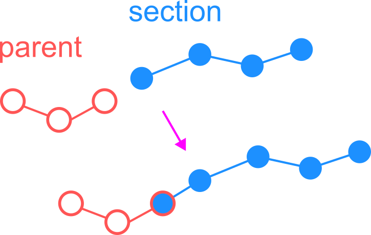

Working with SWC files
==========================================

Reading SWC files
------------------------------------------

As an optional preprocessing step, we can read the SWC file into a pandas DataFrame.

.. code-block:: python

    >>> from dendrotweaks.morphology.io import SWCReader
    >>> reader = SWCReader()
    >>> df = reader.read('path/to/swc_file.swc')

    
We can use functionality of Pandas to perform EDA 
and tidy up the data if needed. 

.. code-block:: python

    >>> df.head()

Typically we should check:

* what types are present and if they are correct, if the tree is sorted by type.
* the statistics for the coordinates and the 'spread' of the data, to get some idea of how the neuron is oriented in space. For a pyramidal neuron the apical dendrite typically aligned with the Y axis.
* Soma notation

Creating an SWC tree
------------------------------------------

To create an SWC tree from the DataFrame, use the following code:

.. code-block:: python

    >>> from dendrotweaks.morphology.io import TreeFactory
    >>> factory = TreeFactory()
    >>> swc_tree = factory.create_swc_tree(df)

.. tip:: 
    
    You can directly pass the path to the SWC file to the `create_swc_tree` method if you do not need to perform the preprocessing steps manually.

Postporcessing
------------------------------------------

We now want to make sure that the nodes are properly sorted. 
For this we will perform depth-first traversal of the tree and update each node's index as we visit the node.

.. code-block:: python

    >>> swc_tree.sort()

.. figure:: ../_static/traversal.png
    :align: center
    :width: 50%
    :alt: Sorting the SWC tree

    *Figure 1: Traversing and sorting the SWC tree*

We can also shift the tree to the soma center and align the apical dendrite with the vertical axis.

.. code-block:: python

    >>> swc_tree.shift_coordinates_to_soma_center()
    >>> swc_tree.align_apical_dendrite(axis='Y', facing='up')

We can also utilize the :code:`rotate` method to rotate the tree around the specified axis.

.. code-block:: python

    >>> swc_tree.rotate(angle=90, axis='Y')

Soma notation
------------------------------------------

The soma can be represented in different ways in SWC files:

* Three-point soma: the soma is represented by three points
* One-point soma: the soma is represented by a single point
* Contour: a set of points that define the soma boundary

For more details, refer to the `Soma format representation in NeuroMorpho.Org <https://neuromorpho.org/SomaFormat.html>`_

The :code:`soma_notation` attribute of the SWC tree provides information about the soma notation.

.. code-block:: python

    >>> swc_tree.soma_notation
    1PS

To change the soma notation, use the :code:`change_soma_notation` method.

.. code-block:: python

    >>> swc_tree.change_soma_notation('3PS')
    Changed soma notation to 3PS

.. note::

    Note that it is not possible to change the soma notation to a contour.

Creating a section tree
------------------------------------------

Now we can create a section tree using the SWC tree.

.. code-block:: python

    >>> sec_tree = factory.create_sec_tree(swc_tree, extend=True)

This method partitions the SWC tree by assigning each node to a section. The algorithm for sectioning is shown in the figure below.

.. figure:: ../_static/sectioning.png
    :align: center
    :width: 60%
    :alt: Splitting the SWC tree into sections

    *Figure 2: Splitting the SWC tree into sections*

If the `extend` flag is set to `True`, the sections will be extended. This is useful for SWC files where sections appear detached from their parent. The method adds a point at the beginning of each section (if it does not overlap with the end of its parent section) with the same coordinates as the end point of its parent section. Note that by default, soma children are not extended, as the soma is assumed to have a spherical shape and its children do not start immediately from the soma center.

    *Figure 3: Extending the sections*

.. warning::

    Note that extending sections mutates the :code:`swc_tree` object by inserting new nodes.
    There is no way to revert the extension, so the :code:`swc_tree` object has to be re-created if the extension is not desired.

.. note::

    If some parts of the tree appear geometrically "disconnected", the simulation results will generally remain accurate 
    as long as the parent-child relationships are maintained. 
    However, it is recommended to extend the sections to achieve more accurate section geometry.

