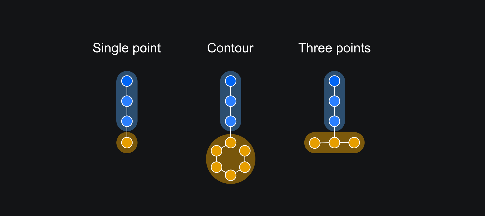
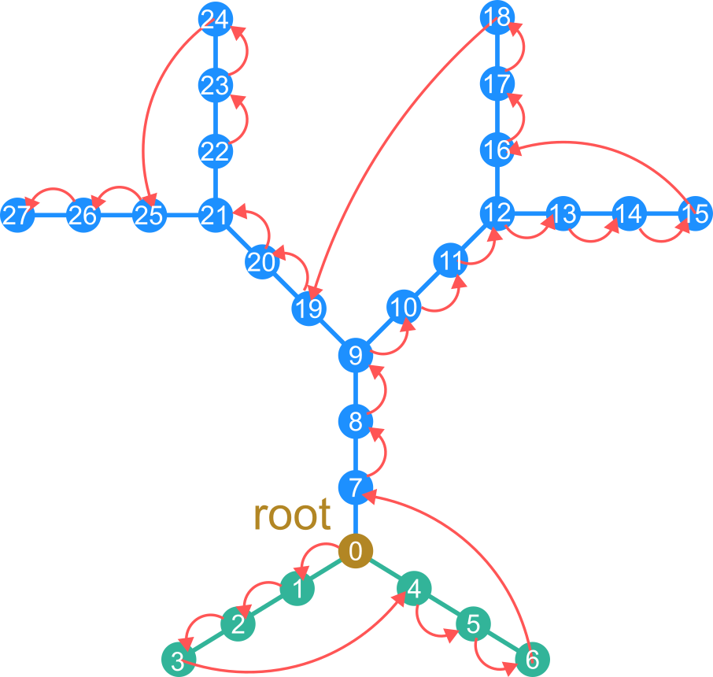
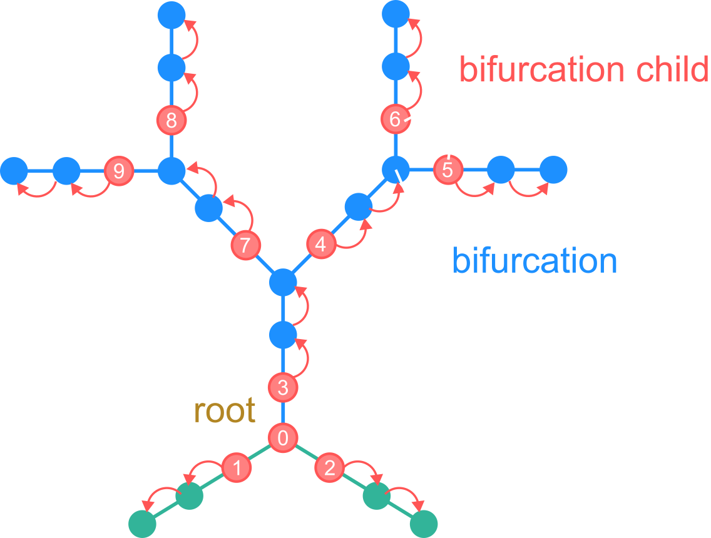

Working with SWC files
==========================================

Reading SWC files
------------------------------------------

As an optional preprocessing step, we can read the SWC file into a pandas DataFrame.

.. code-block:: python

    >>> from dendrotweaks.morphology.io import SWCReader
    >>> reader = SWCReader()
    >>> df = reader.read('path/to/swc_file.swc')

    
We can use functionality of Pandas to perform EDA 
and tidy up the data if needed. 

.. code-block:: python

    >>> df.head()

Typically we should check:

* what types are present and if they are correct, if the tree is sorted by type.
* the statistics for the coordinates and the 'spread' of the data, to get some idea of how the neuron is oriented in space. For a pyramidal neuron the apical dendrite typically aligned with the Y axis.
* Soma notation

Creating a point tree
------------------------------------------

To create a point tree from the DataFrame, we can use the :code:`create_point_tree` method
that
separates tree creation from usage.

.. code-block:: python

    >>> from dendrotweaks.morphology.io import create_point_tree
    >>> point_tree = create_point_tree(df)

.. tip:: 
    
    You can directly pass the path to the SWC file to the 
    `create_point_tree` method if you do not need to perform 
    the preprocessing steps manually.

Postporcessing
------------------------------------------

We will now perform some postprocessing steps on the point tree.
First, we will remove any overlapping nodes.

.. code-block:: python

    >>> point_tree.remove_overlaps()
    Removed 10 overlapping nodes

Soma notation
~~~~~~~~~~~~~~~~~~~~~~~~~~~~~~

Next, we will check and standardize the soma notation of the tree.
The soma can be represented in different ways in SWC files:

* Three-point soma: the soma is represented by three points
* One-point soma: the soma is represented by a single point
* Contour: a set of points that define the soma boundary

According to NeuroMorpho.org, the three-point soma notation is considered the standard representation.
For more details, refer to the `Soma format representation in NeuroMorpho.Org <https://neuromorpho.org/SomaFormat.html>`_

    *Figure 1: Different soma notations*

The :code:`soma_notation` attribute of the point tree provides information about the soma notation.

.. code-block:: python

    >>> point_tree.soma_notation
    1PS

To change the soma notation, use the :code:`change_soma_notation` method.

.. code-block:: python

    >>> point_tree.change_soma_notation('3PS')
    Changed soma notation to 3PS

.. note::

    Note that it is not possible to change the soma notation to a contour.

Sorting the tree
~~~~~~~~~~~~~~~~~~~~~~~~~~~~~~

We now want to make sure that the nodes are properly sorted.
For this we will perform depth-first traversal of the tree and update each node's index as we visit the node.

.. code-block:: python

    >>> point_tree.sort()

The figure below illustrates the traversal and sorting of the point tree.

    *Figure 2: Traversing and sorting the point tree*

.. tip::

    The :code:`sort` method is based on a more generic :code:`traverse` method that can be used to perform any operation on the tree nodes.
    However, once the tree is sorted, it is more efficient to iterate over the :code:`point_tree.points` attribute directly.

Shifting and aligning the tree
~~~~~~~~~~~~~~~~~~~~~~~~~~~~~~~

We can also shift the tree to the soma center and align the apical dendrite with the vertical axis.

.. code-block:: python

    >>> point_tree.shift_coordinates_to_soma_center()
    >>> point_tree.align_apical_dendrite(axis='Y', facing='up')
    >>> point_tree.round_coordinates(5)

We can also utilize the :code:`rotate` method to rotate the tree around the specified axis.

.. code-block:: python

    >>> point_tree.rotate(angle=90, axis='Y')

Creating a section tree
------------------------------------------

Now we can create a section tree using the point tree.

.. code-block:: python

    >>> from dendrotweaks.morphology.io import create_section_tree
    >>> sec_tree = create_sec_tree(point_tree)

This method partitions the point tree by assigning each node to a section. The algorithm for sectioning is shown in the figure below.

    *Figure 3: Splitting the point into sections*

Note that with this sectioning algorithm the bifurcation points are assigned to the parent section.
We need to copy them to the child sections to maintain the correct section geometry. i.e. each section starts where
it's parent ends.
If some parts of the tree appear geometrically "disconnected", the simulation results will generally remain accurate 
as long as the parent-child relationships are maintained. 
However, we extend the sections by copying the bifurcation nodes to achieve more accurate section geometry.

Modifying tree structure
------------------------------------------

We can modify the tree by adding, removing, or repositioning nodes.
The methods below are defined for the more generic :code:`Tree` class,
and therefore avaliable for both :code:`PointTree` and :code:`SectionTree` classes.
Below are some examples of how to modify the tree structure:

.. code-block:: python

    >>> pt = point_tree.points[100]
    >>> point_tree.remove_node(pt)
    >>> point_tree.sort()

.. code-block:: python

    >>> sec = sec_tree.sections[10]
    >>> sec_tree.remove_subtree(sec)
    >>> sec_tree.sort()

We can also detach a subtree from the parent section and re-attach it to another section.

.. code-block:: python

    >>> pt = point_tree.points[100]
    >>> new_parent = point_tree.points[200]
    >>> point_tree.reposition_subtree(pt, new_parent=new_parent)
    >>> point_tree.sort()

Validation
------------------------------------------

We can validate the tree structure by checking the following:

* Unique node IDs
* Unique root node
* No duplicates in children lists
* Valid connectivity (each node can be reached from the root)
* No loops
* Neurites are binary trees (each node has at most two children)
* Nodes are sorted (by depth-first traversal)

Additionaly for the point tree:

* No overlapping nodes
* No bifurcation points within the soma, except for the root node
* No unset values for the coordinates and radii

Additionally for the section tree:

* Domains of the points in each section match the section's domain
* No sections with zero length

.. code-block:: python

    >>> from dendrotweaks.morphology import validate_tree
    >>> validate_tree(sec_tree)

Note that validation for the section tree includes validation for the point and segment trees as well.